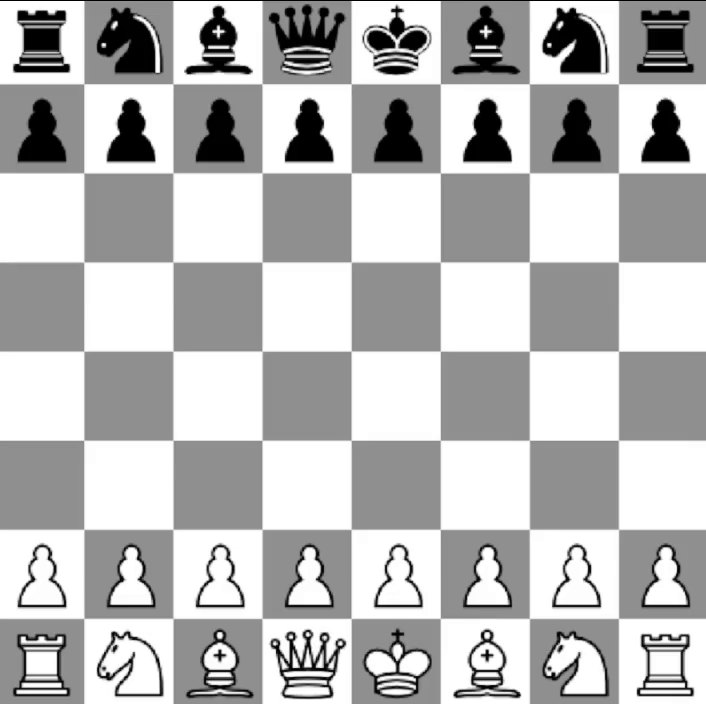

# 3D Chess Game
This project is a 3D chess game developed in Python using OpenGL and it is a part of Computer Graphics course project.

All 3D models of the chess pieces and the board were custom-designed and created by me and my colleague using Fusion 360.

## About the game
This game allows switching between 3D and 2D modes. It also features sound effects that indicate each move, helping you better follow the gameplay.

__3D mode__

__2D mode__

## Game control
| Key          | Action                                      |
|--------------|---------------------------------------------|
| Esc          | Quit the game                               |
| Space        | Switch game mode (3D / 2D)                  |
| A            | Rotate board counterclockwise around Z axis |
| D            | Rotate board clockwise around Z axis        |
| ←            | Undo move                                   |
| →            | Redo move                                   |
| Left click   | Select a square on the board                |
| Right click  | Rotate camera on X and Y axes               |
| Scroll wheel | Zoom in/out                                 |
